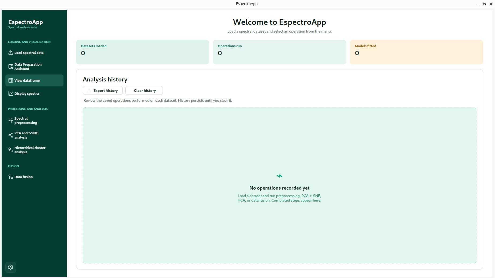
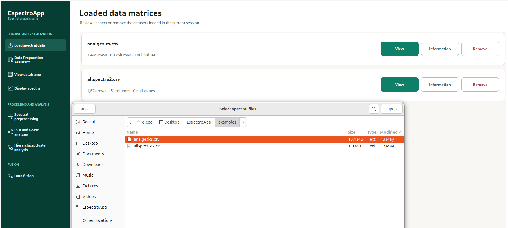
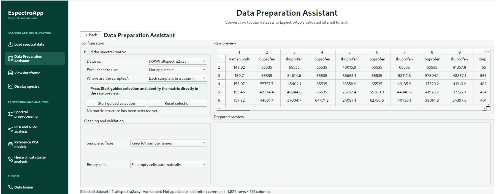
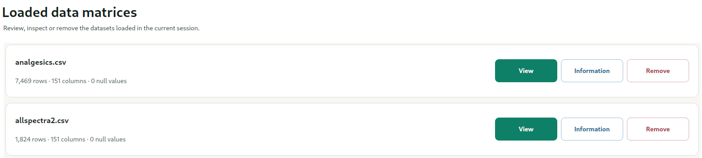
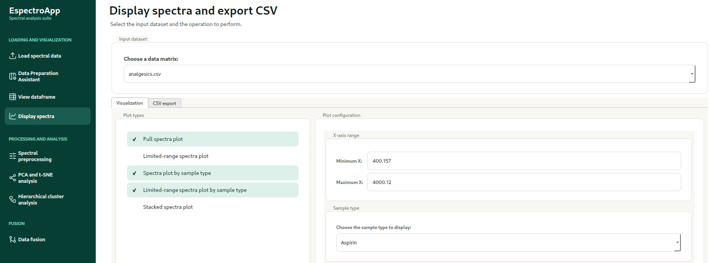
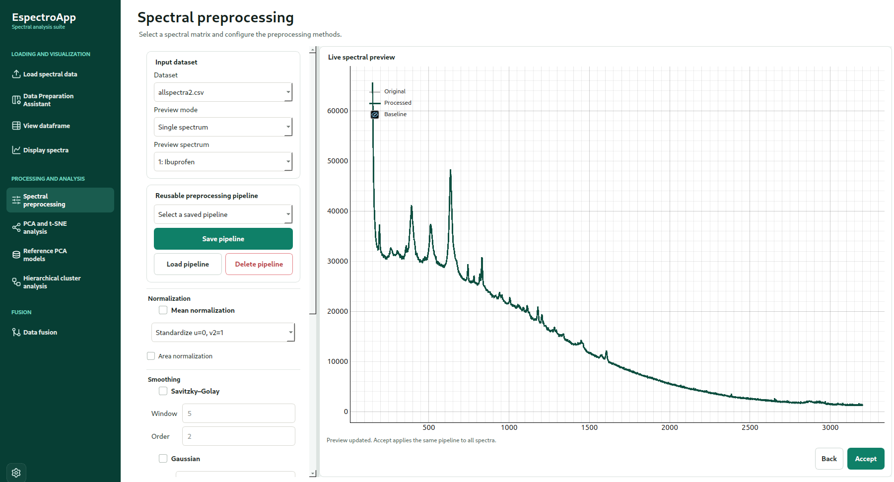
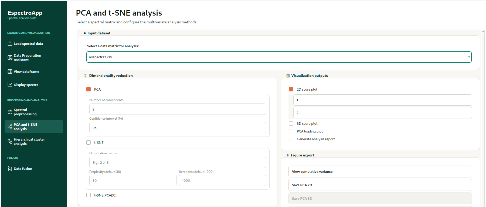
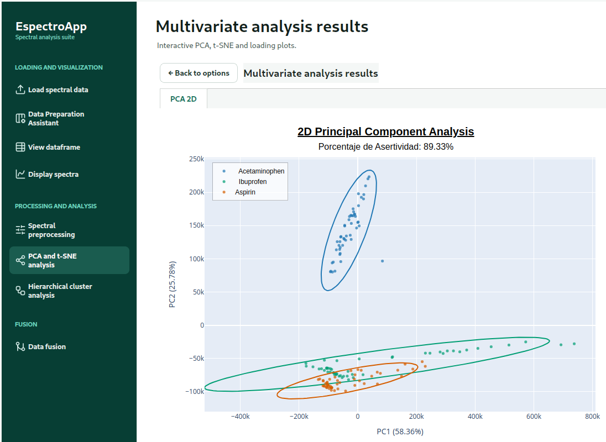
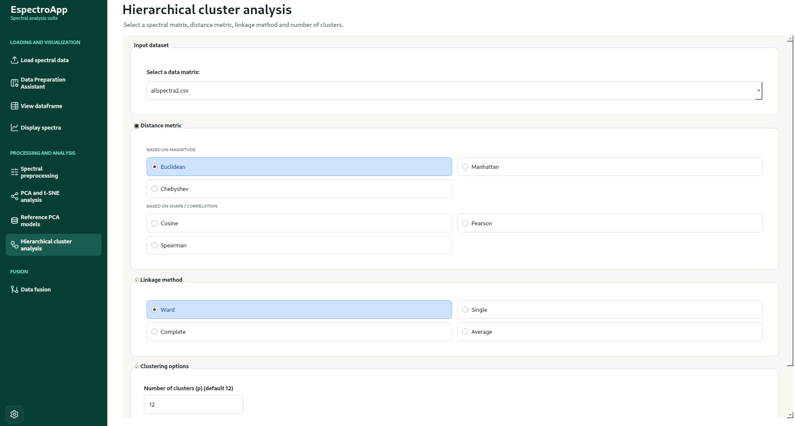
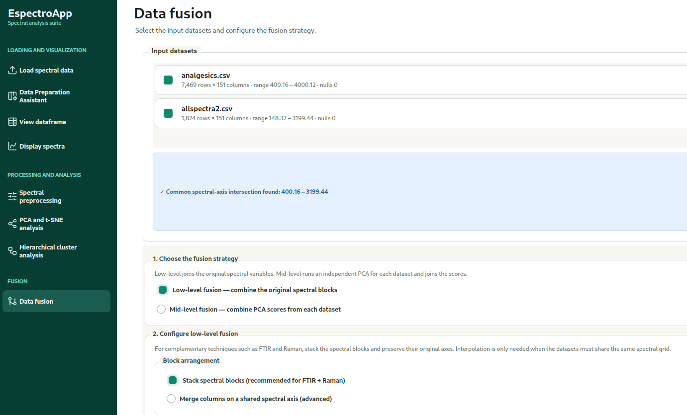

# EspectroApp — Guía de usuario

## 1. Introducción

**EspectroApp** es una aplicación de escritorio para la preparación, visualización, preprocesamiento y análisis multivariado de datos espectrales. Aunque puede utilizarse con datos provenientes de técnicas como FTIR y Raman, su funcionamiento no está limitado a estas técnicas. La aplicación puede trabajar con matrices numéricas obtenidas mediante otras técnicas espectroscópicas o instrumentales, siempre que los datos puedan organizarse en el formato tabular requerido por el software. EspectroApp permite aplicar transformaciones matemáticas, generar análisis exploratorios y realizar fusión de datos.

La aplicación fue desarrollada en Python con una interfaz gráfica basada en PySide6. Su propósito es facilitar el tratamiento de datos espectrales mediante un flujo de trabajo visual, evitando que el usuario tenga que programar cada análisis de forma manual.

### 1.1 Funciones principales

EspectroApp permite:

- cargar datasets espectrales;
- preparar y adaptar archivos con diferentes delimitadores y encabezados;
- detectar valores faltantes o muestras incompletas;
- visualizar tablas y espectros;
- aplicar preprocesamientos espectrales;
- realizar PCA y t-SNE;
- generar gráficos de loadings;
- guardar y reutilizar modelos PCA de referencia;
- proyectar nuevas muestras compatibles en modelos PCA guardados;
- ejecutar análisis de agrupamiento jerárquico;
- realizar fusión de datos de bajo y medio nivel;
- guardar y reabrir proyectos completos;
- exportar figuras y resultados;
- consultar y exportar el historial de análisis en CSV o JSON;
- cambiar el idioma de la interfaz.

---

## 2. Requisitos del sistema

### 2.1 Sistemas operativos

EspectroApp puede ejecutarse en:

- Windows;
- Linux;
- macOS, siempre que las dependencias sean compatibles.

### 2.2 Requisitos recomendados

- procesador de 64 bits;
- 8 GB de memoria RAM o más;
- espacio disponible para datasets, figuras y resultados;
- resolución de pantalla mínima recomendada de 1366 × 768;
- Python 3.12 o superior para ejecutar desde el código fuente.

> La cantidad de memoria necesaria depende del número de muestras, variables espectrales y gráficos generados.

---
## 3. Instalación

### 3.1 Ejecución desde el código fuente

Clone el repositorio:

```bash
git clone https://github.com/diegoseo/EspectroApp.git
cd EspectroApp
```

Cree un entorno virtual.

En Linux o macOS:

```bash
python3 -m venv .venv
```

En Windows:

```powershell
python -m venv .venv
```

o:

```powershell
py -m venv .venv
```

Active el entorno virtual.

En Linux o macOS:

```bash
source .venv/bin/activate
```

En Windows PowerShell:

```powershell
.venv\Scripts\Activate.ps1
```

En el Símbolo del sistema de Windows:

```cmd
.venv\Scripts\activate.bat
```

Actualice pip e instale las dependencias:

```bash
python -m pip install --upgrade pip
python -m pip install -r requirements.txt
```

Ejecute la aplicación:

```bash
python src/app.py
```


### 3.2 Nota para Windows PowerShell

Si PowerShell no permite activar el entorno virtual, ejecute:

```powershell
Set-ExecutionPolicy -Scope Process -ExecutionPolicy Bypass
```

Luego active nuevamente el entorno:

```powershell
.venv\Scripts\Activate.ps1
```

Este cambio se aplica únicamente a la sesión actual de PowerShell.

### 3.3 Uso de ejecutables e instaladores

Para utilizar EspectroApp sin instalar Python, descargue el paquete correspondiente desde la sección **Releases** del repositorio. Linux dispone de una carpeta ejecutable portátil y de un instalador `.deb` para sistemas Debian/Ubuntu de 64 bits. Los paquetes de Windows y macOS se publican por separado.

---

## 4. Descripción general de la interfaz

La ventana principal se divide en dos zonas:

1. **Barra lateral:** contiene los accesos a los módulos de trabajo.
2. **Área principal:** muestra formularios, resultados, tablas, gráficos e historial.

Los módulos finales de la barra lateral son:

- **Cargar datos espectrales**;
- **Asistente de preparación de datos**;
- **Ver DataFrame**;
- **Visualizar espectros**;
- **Preprocesamiento espectral**;
- **Análisis PCA y t-SNE**;
- **Modelos PCA de referencia**;
- **Análisis de agrupamiento jerárquico**;
- **Fusión de datos**.

El menú de configuración permite gestionar proyectos, cambiar el idioma y acceder a opciones de sesión. La página de bienvenida muestra el historial de análisis y los contadores de datasets, operaciones y modelos guardados.



---

## 5. Formato de los datasets

### 5.1 Formato interno esperado

EspectroApp utiliza una matriz donde:

- la primera columna contiene el eje espectral;
- la primera fila contiene los nombres o clases de las muestras;
- cada columna restante representa una muestra;
- cada fila posterior representa una variable espectral.

Ejemplo:

| Wavenumbers (1/cm) | Aspirin | Aspirin | Ibuprofen | Acetaminophen |
|---:|---:|---:|---:|---:|
| 450 | 0.121 | 0.116 | 0.188 | 0.152 |
| 451 | 0.124 | 0.119 | 0.191 | 0.155 |
| 452 | 0.129 | 0.123 | 0.195 | 0.159 |

### 5.2 Archivos admitidos

EspectroApp admite principalmente los siguientes formatos:

- archivos CSV (`.csv`);
- archivos de texto delimitado (`.txt`);
- archivos espectrales (`.spa`);
- hojas de cálculo de Excel (`.xlsx` y `.xls`), cuando la versión instalada y los módulos de importación correspondientes estén disponibles.

### 5.3 Datasets sin preparar

Cuando un archivo se carga como dataset bruto, la aplicación puede mostrar el mensaje:

```text
RAW dataset loaded. Use the Data Preparation Assistant before analysis.
```

Esto significa que el archivo debe pasar primero por el **Asistente de preparación de datos** antes de utilizar los módulos analíticos.

---

## 6. Carga de datos

1. Abra EspectroApp.
2. Seleccione **Cargar dataset** en la barra lateral.
3. Busque el archivo en el equipo.
4. Confirme la selección.
5. Revise que el nombre del dataset aparezca en la lista de datos disponibles.

La carga no modifica el archivo original.

Si el dataset no presenta el formato interno esperado, utilice el módulo de preparación antes de continuar.

---



## 7. Asistente de preparación de datos

El Asistente de preparación permite adaptar datasets externos al formato utilizado por EspectroApp.

Entre sus funciones se encuentran:

- selección o detección del delimitador;
- identificación del eje espectral;
- selección de la fila de encabezado;
- tratamiento de encabezados dobles;
- eliminación de prefijos o sufijos en nombres de muestras;
- definición de nombres o clases;
- detección de celdas vacías;
- identificación de muestras con diferente número de puntos;
- eliminación de muestras incompletas;
- igualación de la longitud de las muestras;
- vista previa antes de aceptar los cambios.

### Procedimiento general

1. Cargue el archivo.
2. Abra **Asistente de preparación de datos**.
3. Seleccione el dataset.
4. Indique si las muestras están organizadas por filas o por columnas.
5. Seleccione la fila o columna que contiene los nombres de las muestras.
6. Seleccione la fila o columna correspondiente al eje espectral.
7. Marque la primera celda del bloque de intensidades.
8. Configure la limpieza de sufijos y el tratamiento de celdas vacías cuando sea necesario.
9. Revise la vista previa y presione **Aceptar** para generar un nuevo dataset preparado.

El asistente admite encabezados adicionales o dobles, transposición, nombres repetidos, celdas vacías y muestras con diferentes longitudes. El archivo original no se modifica.





---

## 8. Visualización de tablas

El módulo de visualización de DataFrames permite inspeccionar la estructura del dataset antes de realizar análisis.

Se recomienda comprobar:

- que la primera columna corresponda al eje espectral;
- que los nombres o clases estén correctamente ubicados;
- que no existan columnas vacías;
- que todas las muestras tengan el mismo número de observaciones;
- que las intensidades sean numéricas.

---



---

## 9. Visualización de espectros

El módulo de espectros permite representar gráficamente las señales cargadas.   

- visualización de todos los espectros;
- visualización por clase;
- selección de rango espectral;
- espectros apilados;
- visualización de espectros promedio;
- exportación de imágenes.

### Procedimiento

1. Seleccione **Visualización de espectros**.
2. Elija el dataset.
3. Defina el tipo de visualización.
4. Seleccione el rango espectral, cuando corresponda.
5. Genere el gráfico.
6. Utilice la opción de exportación para guardar la figura.




---

## 10. Preprocesamiento espectral

El preprocesamiento permite reducir variaciones no relacionadas con la composición química y preparar los datos para el análisis multivariado.

### Métodos disponibles

- corrección lineal de línea base;
- corrección Shirley;
- normalización por la media;
- normalización por área;
- suavizado Savitzky–Golay;
- filtro gaussiano;
- media móvil;
- primera derivada;
- segunda derivada.

### Procedimiento general

1. Abra **Preprocesamiento**.
2. Seleccione el dataset.
3. Active las operaciones deseadas.
4. Configure los parámetros.
5. Revise la vista previa.
6. Aplique el pipeline.
7. Asigne un nombre al dataset procesado.
8. Confirme la operación.

### Recomendaciones

- no aplique transformaciones sin justificar su finalidad;
- compare siempre el espectro original con el procesado;
- evite ventanas de suavizado excesivamente grandes;
- revise que las derivadas no amplifiquen demasiado el ruido;
- conserve el dataset original para comparación.



### Uso de pipelines de preprocesamiento

Un **pipeline** es una secuencia ordenada de operaciones que se aplica automáticamente al dataset. Su función es organizar el preprocesamiento, evitar repeticiones manuales y garantizar que todas las muestras reciban exactamente las mismas transformaciones y parámetros.

Por ejemplo, un pipeline puede incluir:

```text
Corrección de línea base
→ suavizado Savitzky–Golay
→ normalización por área
→ segunda derivada
```

El orden de las operaciones es importante, ya que cada transformación modifica el resultado que recibe la siguiente etapa.

Los pipelines permiten:

- combinar varias operaciones en un único flujo de trabajo;
- aplicar la misma secuencia a todas las muestras;
- reducir errores por configuraciones diferentes entre análisis;
- guardar o reutilizar procedimientos de preprocesamiento;
- facilitar la comparación entre datasets;
- mejorar la reproducibilidad de los resultados.

Antes de aplicar un pipeline completo, se recomienda revisar la vista previa y comprobar que la señal conserve las características espectrales relevantes.

---

## 11. PCA y t-SNE

El módulo de reducción de dimensionalidad permite realizar análisis exploratorios mediante **PCA**, **t-SNE** y **t-SNE aplicado después de PCA**.

EspectroApp permite ejecutar uno o varios métodos dentro del mismo análisis. El usuario puede seleccionar:

- únicamente **PCA**;
- únicamente **t-SNE**;
- únicamente **t-SNE(PCA(X))**;
- una combinación de dos métodos;
- los tres métodos simultáneamente.

Solo se generarán los análisis y gráficos correspondientes a las opciones activadas. Esto permite comparar diferentes estrategias de reducción de dimensionalidad utilizando el mismo dataset.

### 11.1 PCA

El análisis de componentes principales reduce el número de variables y permite observar:

- agrupamiento de muestras;
- separación entre clases;
- posibles muestras atípicas;
- porcentaje de varianza explicada;
- contribución de las variables mediante loadings.

Parámetros principales:

- número de componentes principales;
- intervalo de confianza;
- componentes utilizadas en los ejes de los gráficos 2D o 3D;
- componentes seleccionadas para los gráficos de loadings.

### 11.2 t-SNE

t-SNE permite visualizar relaciones no lineales entre muestras y explorar la formación de agrupamientos en espacios de menor dimensión.

Parámetros principales:

- número de dimensiones de salida;
- perplejidad;
- número de iteraciones.

> EspectroApp utiliza una semilla aleatoria fija (`random_state = 42`) para mejorar la reproducibilidad de los resultados de t-SNE. Por este motivo, al utilizar el mismo dataset y los mismos parámetros, se espera obtener resultados consistentes entre ejecuciones.

### 11.3 t-SNE después de PCA

La opción **t-SNE(PCA(X))** permite reducir primero el número de variables mediante PCA y ejecutar posteriormente t-SNE sobre las componentes principales seleccionadas.

Este procedimiento puede reducir el costo computacional, disminuir el efecto del ruido y facilitar el análisis de datasets con un número elevado de variables.

Parámetros principales:

- número de componentes principales utilizadas antes de t-SNE;
- número de dimensiones de salida;
- perplejidad;
- número de iteraciones.

### 11.4 Procedimiento general
1. Elija el dataset que desea analizar.
2. Active uno o más métodos:
   - **PCA**;
   - **t-SNE**;
   - **t-SNE(PCA(X))**.
3. Para PCA, defina el número de componentes y el intervalo de confianza.
4. Para t-SNE, indique el número de dimensiones, la perplejidad y el número de iteraciones.
5. Para t-SNE(PCA(X)), indique el número de componentes principales que se utilizarán antes de ejecutar t-SNE.
6. Active los gráficos 2D o 3D que desee generar.
7. Seleccione las componentes correspondientes a cada eje.
8. Active los loadings cuando utilice PCA y necesite analizar la contribución de las variables.
9. Active la opción **Generar reporte** cuando desee crear un informe con los resultados y parámetros del análisis.
10. Presione **Aceptar** para ejecutar los métodos seleccionados.






### Uso de la varianza acumulada

La opción **Varianza acumulada** permite estimar cuántas componentes principales deben conservarse en el análisis PCA. Se recomienda seleccionar el menor número de componentes que alcance un porcentaje elevado de varianza explicada, por ejemplo, 95 %.

> El número de componentes retenidas no determina cuántas deben mostrarse en el gráfico. Por ejemplo, el modelo puede conservar cuatro componentes y representar únicamente PC1 y PC2.


### Evaluación mediante KNN

EspectroApp utiliza **K-Nearest Neighbors (KNN)** con `k = 3` como evaluación complementaria de la separación entre las clases. La exactitud se calcula mediante validación cruzada estratificada de hasta **5 particiones**, manteniendo en cada partición una proporción semejante de muestras por clase.

Cuando alguna clase tiene menos de cinco muestras, el número de particiones se reduce automáticamente al máximo permitido. El porcentaje mostrado corresponde al promedio de exactitud obtenido en todas las particiones.

> Un valor elevado indica que las muestras de una misma clase tienden a encontrarse próximas entre sí, pero debe interpretarse junto con los gráficos de PCA o t-SNE.


---

## 12. Loadings de PCA

Los loadings indican la contribución de cada variable original a las componentes principales.

### Interpretación básica

- valores positivos altos indican contribución positiva;
- valores negativos altos indican contribución negativa;
- valores cercanos a cero indican menor influencia;
- picos importantes pueden relacionarse con regiones espectrales responsables de la separación observada.

### Procedimiento

1. Active **PCA loading plot**.
2. Seleccione las componentes.
3. Ejecute el análisis.
4. Compare los loadings con el score plot.
5. Relacione los máximos y mínimos con bandas espectrales relevantes.

---

## 13. Modelos PCA de referencia

El módulo **Modelos PCA de referencia** permite conservar un modelo PCA ajustado y utilizarlo posteriormente para proyectar nuevas muestras.

### 13.1 Guardar un modelo de referencia

1. Ejecute un análisis PCA sobre el dataset de referencia.
2. Active la opción para conservar o registrar el modelo ajustado.
3. Asigne un nombre descriptivo al modelo.
4. Abra **Modelos PCA de referencia** para verificar que el modelo aparezca en la lista.

El proyecto guarda los parámetros del PCA, las variables utilizadas y el artefacto necesario para realizar nuevas proyecciones.

### 13.2 Compatibilidad de nuevas muestras

Antes de proyectar un nuevo dataset, EspectroApp verifica que:

- tenga el mismo número de variables;
- conserve el mismo orden de variables;
- utilice los mismos valores del eje espectral;
- sea compatible con el preprocesamiento aplicado al modelo de referencia.

Los nombres y la cantidad de muestras pueden ser diferentes.

### 13.3 Proyección de nuevas muestras

1. Cargue el dataset nuevo.
2. Abra **Modelos PCA de referencia**.
3. Seleccione el modelo guardado.
4. Seleccione el dataset que será proyectado.
5. Ejecute la aplicación del modelo.
6. Seleccione la representación:
   - PC1 × PC2;
   - PC1 × PC3;
   - PC2 × PC3;
   - PC1 × PC2 × PC3, cuando el modelo tenga tres o más componentes.
7. Active los nombres de las muestras proyectadas cuando sea necesario.
8. Utilice zoom, desplazamiento, información emergente y exportación para inspeccionar el resultado.

Las muestras de referencia y las proyectadas se muestran con categorías visuales diferentes.

---

## 14. Análisis de agrupamiento jerárquico

El módulo HCA permite agrupar muestras según su similitud.

Los resultados pueden incluir:

- dendrograma;
- mapa de calor;
- matriz de distancias;
- identificación de grupos o clústeres;
- tabla de asignación de clústeres;
- composición de cada clúster;
- exportación de resultados.

### Procedimiento general

1. Abra **HCA**.
2. Seleccione el dataset.
3. Configure la métrica de distancia.
4. Seleccione el método de enlace.
5. Defina el número de clústeres, cuando corresponda (12 por defecto).
6. Ejecute el análisis.
7. Interprete la proximidad entre las muestras y la formación de grupos.



---

## 15. Fusión de datos

EspectroApp permite combinar información de dos datasets compatibles.

### 15.1 Fusión de bajo nivel

La fusión de bajo nivel concatena las variables originales de los datasets.

Puede incluir:

- detección del rango espectral común;
- selección de concatenación vertical u horizontal;
- interpolación;
- uso de ejes originales;
- definición del rango de fusión.

### 15.2 Fusión de nivel medio

La fusión de nivel medio combina características extraídas previamente, por ejemplo componentes principales o variables seleccionadas.

### Recomendaciones

- confirme que las muestras correspondan entre los datasets;
- revise el orden de las muestras;
- compruebe las unidades de los ejes;
- documente si se utilizó interpolación;
- conserve los datasets originales.



---

## 16. Historial de análisis

EspectroApp registra las operaciones realizadas durante la sesión y conserva información sobre el flujo de trabajo aplicado a cada dataset.

El historial puede mostrar:

- dataset utilizado;
- fecha y hora;
- operación realizada;
- parámetros principales;
- dataset de salida;
- análisis multivariados;
- preprocesamientos;
- fusiones de datos.

### Exportación del historial en formatos CSV y JSON

El historial puede exportarse como archivo **CSV** (`.csv`) o **JSON** (`.json`). Este formato organiza la información mediante campos y valores estructurados, lo que permite conservar de manera ordenada los parámetros y operaciones ejecutados durante el análisis.

El archivo JSON puede incluir información como:

- nombre del dataset;
- fecha y hora del análisis;
- método aplicado;
- parámetros utilizados;
- operaciones de preprocesamiento;
- métodos de reducción de dimensionalidad;
- configuraciones de HCA;
- procedimientos de fusión;
- nombres de los datasets generados.

Ejemplo simplificado:

```json
{
  "dataset": "ftir_procesado.csv",
  "operation": "PCA",
  "parameters": {
    "components": 5,
    "confidence_interval": 0.95
  },
  "date": "2026-07-16 18:30:00"
}
```
### Opciones

- **Exportar historial:** guarda el registro para documentación.
- **Limpiar historial:** elimina los registros almacenados.

El historial se muestra en el idioma activo de la interfaz.

---

## 18. Cambio de idioma

Para cambiar el idioma:

1. Abra **Configuración**.
2. Seleccione **Idioma**.
3. Elija español, portugués o inglés.
4. La interfaz se actualizará conservando los datos y resultados abiertos.

---

## 19. Exportación de resultados

Antes de guardar una figura:

- confirme que el gráfico mostrado sea el correcto;
- seleccione la extensión adecuada;
- utilice un nombre descriptivo;
- evite sobrescribir resultados importantes.

---

## 20. Mensajes frecuentes

### “RAW dataset loaded”

El archivo todavía no tiene el formato interno requerido. Utilice el Asistente de preparación.

### “There is no figure to save”

El análisis no generó la figura seleccionada o el botón fue utilizado antes de ejecutar el análisis.

### “The rendered Plotly view was not found”

La vista del gráfico no está disponible. Vuelva a ejecutar el análisis y espere a que aparezca el resultado.

### “No method selected”

Debe seleccionar PCA, t-SNE o t-SNE(PCA(X)) antes de aceptar.

### “Invalid PCA components”

Revise el número de componentes y confirme que no sea superior al número máximo permitido por el dataset.

### Dataset con muestras de diferente longitud

Utilice el Asistente de preparación para eliminar muestras incompletas o igualar la longitud de las columnas.

---

## 21. Buenas prácticas

- conserve siempre una copia del dataset original;
- utilice nombres claros para los datasets procesados;
- registre los parámetros usados;
- revise visualmente cada preprocesamiento;
- no interprete PCA únicamente por la separación visual;
- relacione los loadings con las regiones espectrales;
- compare los resultados antes y después del preprocesamiento;
- exporte el historial al finalizar una sesión importante;
- documente todas las decisiones metodológicas.

---

## 22. Soporte y contacto

Para soporte, consultas o reporte de errores, visite el repositorio oficial:

[https://github.com/diegoseo/EspectroApp.git](https://github.com/diegoseo/EspectroApp.git)

También puede contactar al autor mediante el correo electrónico:

[diego.seo98@fpuna.edu.py](mailto:diego.seo98@fpuna.edu.py)

Para reportar un problema en GitHub, incluya:

- sistema operativo;
- versión de EspectroApp;
- versión de Python, si ejecuta desde el código;
- pasos para reproducir el error;
- mensaje mostrado;
- captura de pantalla;
- dataset mínimo de ejemplo, cuando sea posible y no contenga información confidencial.

Abra el reporte en la sección **Issues** del repositorio.

---

## 22. Créditos y citación

### Autoría

**EspectroApp** fue desarrollado por:

- **Autor:** Diego Hyung Won Seo Gonzalez
- **Institución:** Facultad Politécnica — Universidad Nacional de Asunción
- **Repositorio:** https://github.com/diegoseo/EspectroApp.git
- **Versión:** v1.0.0
- **Año:** 2026

### Forma recomendada de citación

Para trabajos académicos, informes técnicos o publicaciones, se recomienda citar EspectroApp de la siguiente manera:

```text
Seo Gonzalez, Diego Hyung Won. EspectroApp: Open Computational Platform for
Multivariate Analysis and Processing of Spectral Data. Versión 1.0.0.
Facultad Politécnica, Universidad Nacional de Asunción, 2026.
Disponible en: https://github.com/diegoseo/EspectroApp.git
```
